# Microservice Architecture with Nest.js

This will be our backend architecture.

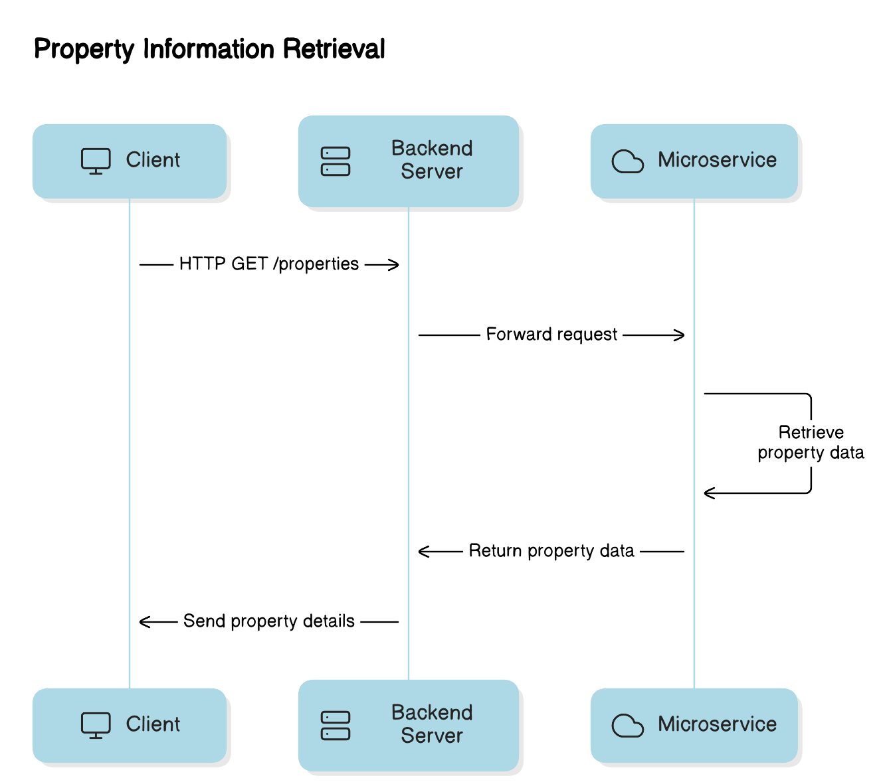

First of all, let's understand a few concepts, such as:

1. What is a typical monolithic project architecture?
2. What are the issues with it?
3. What is microservice architecture?
4. Why do we need it, and how can it benefit us?

In the end, we will create a highly scalable NestJS project.

## What is a typical monolithic project architecture?

A typical monolithic project architecture is a software application that is built as a single unit.

## What are the issues with monolithic architecture?

As we know, a monolithic application is built as **a single unit**. If one part of the application breaks, it can break the entire project. Additionally, if a part of the application is changed, we have to deploy the entire application.

In a monolithic architecture, it is very hard to manage the project, especially if multiple teams are working on it. Although teams use Git to avoid this, you can't overcome this problem entirely. At some point, you will still struggle to manage it.

One of the major issues is **scalability**. In a typical monolithic application, it is very hard to manage the code when you add thousands of files.

By reading the above paragraph, we can identify the main problems with monolithic architecture:

- Increased risk of failures
- Scalability
- Limited technology stack flexibility
- Difficulties in maintenance
- Deployment issues

There is one more thing that is worth mentioning: **technological limitation**. In a typical monolithic architecture, you must develop your entire system in one technology. For example, in the case of the backend, you can either choose Django or Nest, but not both. I am not going to highlight this too much because my focus in this article is just on NestJS, so I'll keep this discussion for a later time.

## What is microservice architecture?

Microservice architecture is a design approach where an application is built as a collection of small, loosely coupled services, each responsible for a specific business function. Each service can be deployed individually without affecting others. As you have probably observed just by reading this definition, most of the issues that we face in monolithic architecture can be solved by microservices.

## How can we benefit from microservices?

Microservices can enhance scalability, flexibility, and ease of maintenance, allowing teams to develop, deploy, and scale each service independently. Microservices can improve fault isolation, as issues in one service don’t necessarily affect others. This architecture is ideal for large, complex applications requiring frequent updates.

## Microservices architecture with Nest.js

Make sure that you have the Nest CLI installed.

Run this command to create a new Nest.js project:

```
nest new .
```

When setting up your project, you'll be prompted with the question:  
**Which package manager would you ❤️ to use?**

For this article, I have chosen **npm**, but feel free to select whichever package manager you prefer!

Once you make your choice, the NestJS project will be initialized shortly. 🚀

Now run this command

```
nest generate app properties
```

it will delete src and test folder and create a mono repo project.

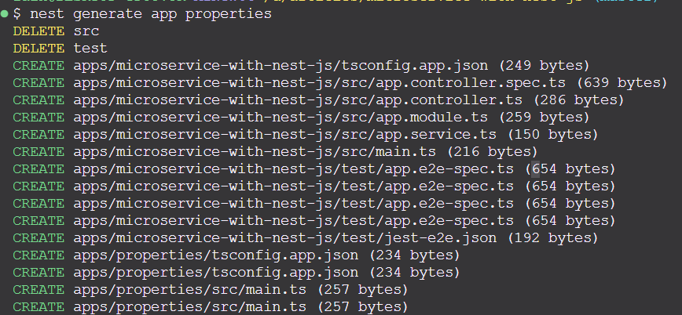

Now you folder structure will look like this
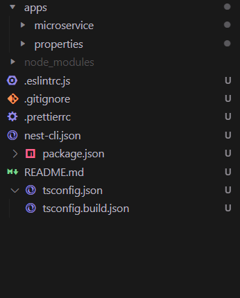

After this, rename the `microservice folder to api-gateway`.
Now you need to update the nest-cli.json file and replace `microservice` with `api-gateway`. We need to do this because we have updated the entry point, and NestJS is not aware of this change.
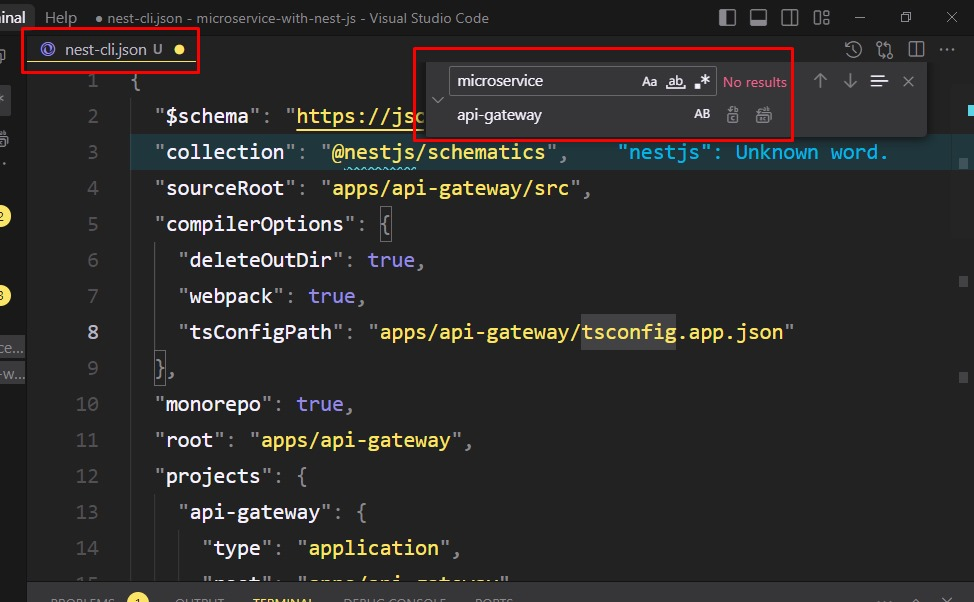

Now update the package.json and past this line in the scripts

```JSON
"start:prod": "node dist/apps/api-gateway/main"
```

Update `apps/api-gateway/tsconfig.app.json`

```JSOn
"outDir": "../../dist/apps/api-gateway"
```

Now open the `properties` microservice and you will currently have these files there
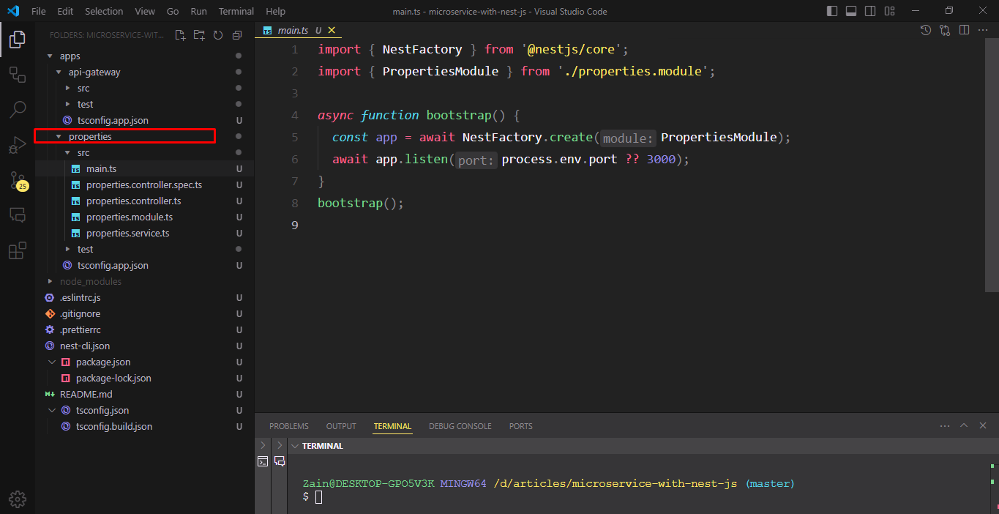

To keep the project modular and organized, I like to create a folder with the same name as the microservice inside the `microservice-name/src/`. Then, cut and paste the files that are related to the new folder. After that, create a new folder named app with the prefix of the microservice application name, such as `microservice-name-app.module`, in the `microservice-name/src` directory.

```
properties/src
└── properties
    ├── properties.controller.spec.ts
    ├── properties.controller.ts
    ├── properties.module.ts
    └── properties.service.ts
└──  properties-app.module.ts
```


and Import properties module inside the properties-app module

```ts
import { Module } from '@nestjs/common';
import { PropertiesModule } from './properties/properties.module';

@Module({
  imports: [PropertiesModule],
})
export class PropertiesAppModule {}
```

Now run this command to install the microservices package

```
npm i --save @nestjs/microservices
```

And initialize a microservice application in the `properties/main.ts` file using microservices instead of a regular NestJS application, using `TCP` as the transporter protocol. You can learn more about it [here](https://docs.nestjs.com/microservices/basics)

```ts
import { NestFactory } from '@nestjs/core';
import { PropertiesAppModule } from './properties-app.module';
import { Transport } from '@nestjs/microservices';

const PROPERTIES_SERVICE_PORT = 3001;
async function bootstrap() {
  const app = await NestFactory.createMicroservice(PropertiesAppModule, {
    transport: Transport.TCP,
    options: {
      port: PROPERTIES_SERVICE_PORT,
    },
  });
  await app.listen();
}
bootstrap();
```

Now run properties microservice with this command

```
nest start properties -w
```

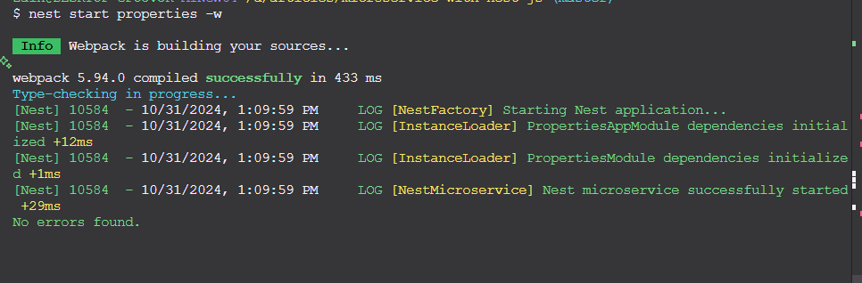

And now create a new module in the API gateway with this command, which will be responsible for interacting with our microservice application:

```
nest generate resource properties --project api-gateway
```

you wil be promoted about the transporter layer and choose the rest api

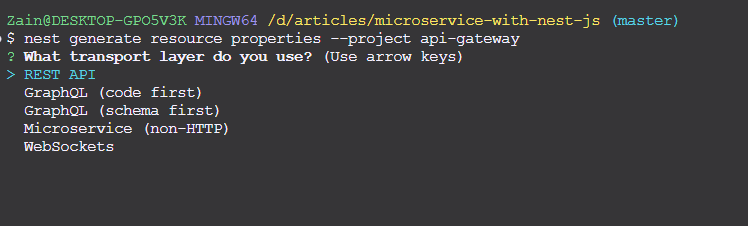

and will ask you to create crud operation and type Y there
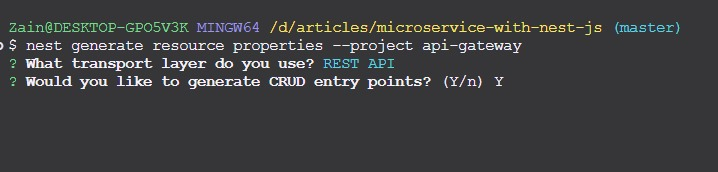

Now this how the `api-gateway/src/properties` will look like
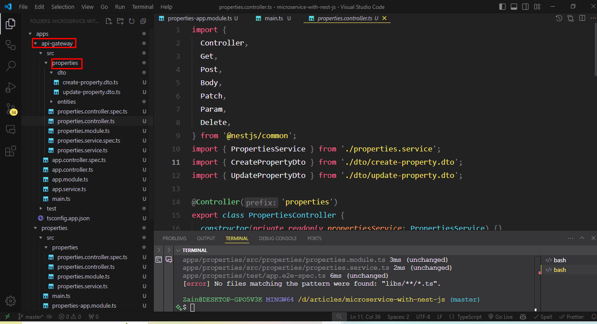

Now go ahead and update the the `api/gateway/src/properties/properties.controller.ts`

```ts
  @Get()
  sayHello() {
    return this.propertiesService.sayHello();
  }
```

And update the `api/gateway/src/properties/properties.service.ts` with this

```ts
  sayHello() {
    return 'Hello from the `api/gateway/src/properties/properties.service.ts`';
  }
```

Run this command to run the server:

```
npm run start:dev
```

open your browser and type url
`[localhost](http://localhost:3000/properties)`
You will see this response
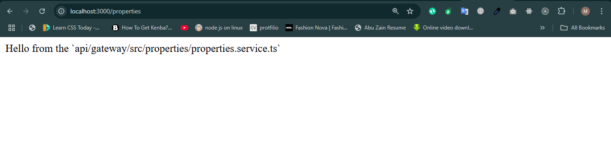

> Great! 🎉 Our server and properties microservice application both are running

But how will our `api-gateway/properties` module communicate with the `properties microservice `application?
The answer is ClientProxy.

#### Client Proxy:

A ClientProxy in NestJS is an abstraction for communication between microservices. It allows one microservice to send messages to another using various transport layers, such as TCP or Redis. The ClientProxy encapsulates the transport logic, providing a consistent interface for sending requests and receiving responses

In a typical NestJS application, communication can primarily occur through two types:

- -Request-Response Pattern-:
  It is similar to HTTP, meaning you send a request and then receive a response.
- -Event-Driven Communication-:This means "emit and forget."

In this project, we will only use the `Request-Response` Pattern with TCP. You can use whatever you want based on your requirements.

in the `apps/api-gateway/src/properties/properties.module.ts` add this code:

```ts
import { Module } from '@nestjs/common';
import { PropertiesService } from './properties.service';
import { PropertiesController } from './properties.controller';
import { ClientsModule, Transport } from '@nestjs/microservices';
export const PROPERTIES_CLIENT = 'PROPERTIES_CLIENT';

@Module({
  imports: [
    ClientsModule.registerAsync([
      {
        name: PROPERTIES_CLIENT,
        useFactory: async () => {
          return {
            transport: Transport.TCP,
            options: {
              port: 3001,
            },
          };
        },
      },
    ]),
  ],
  controllers: [PropertiesController],
  providers: [PropertiesService],
})
export class PropertiesModule {}
```

Keep in mind that the port specified in the `api/gateway/src/properties/properties.module.ts` must match the `properties microservice` application.

Update the `api/gateway/src/properties/properties.service.ts` and inject the proxy with the token specified in `properties.module.ts`:

```ts
  constructor(
    @Inject(PROPERTIES_CLIENT) private readonly propertiesClient: ClientProxy,
  ) {}

  sayHello() {
    return this.propertiesClient.send('properties.findAll', {});
  }

```

While communicating with a microservice via the proxy, you have to specify the pattern `properties.findAll`.I have used a special format for defining the pattern as `domain.action`.

Now open the `apps/properties/src/properties/properties.controller.ts` and update it

```ts
import { Controller } from '@nestjs/common';
import { PropertiesService } from './properties.service';
import { MessagePattern } from '@nestjs/microservices';

@Controller()
export class PropertiesController {
  constructor(private readonly propertiesService: PropertiesService) {}

  @MessagePattern('properties.findAll')
  getHello() {
    return this.propertiesService.getHello();
  }
}
```

Here we are using MessagePattern Decorator to specify a unique pattern for commination
you can lean more about it [here](https://docs.nestjs.com/microservices/basics#patterns)

Open the `apps/properties/src/properties/properties.service.ts` and update it

```ts
import { Injectable } from '@nestjs/common';

@Injectable()
export class PropertiesService {
  getHello(): string {
    return 'Hello from properties microservice!';
  }
}
```

Open your browser again and you will see that now response is coming from the microservice application
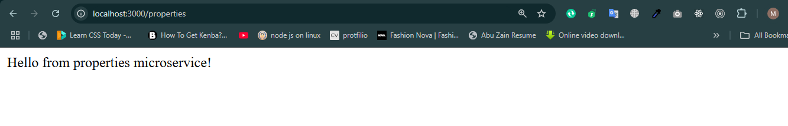

Amazing 🏆 we successful able to communicate with our microservice

### CRUD Operation in Properties Microservice

Open the `apps/properties/src/properties` and create a folder name dto and create
`create-property.dto.ts`

```ts
export class CreatePropertyDto {
  name: string;
  description: string;
  price: number;
  bedrooms: number;
  bathrooms: number;
}
```

`property.dto.ts`

```ts
export class PropertyDto {
  _id: number;
  name: string;
  description: string;
  price: number;
  bedrooms: number;
  bathrooms: number;
}
```

`update-property.dto.ts`

```ts
import { PartialType } from '@nestjs/mapped-types';
import { CreatePropertyDto } from './create-property.dto';

export class UpdatePropertyDto extends PartialType(CreatePropertyDto) {
  id: number;
}
```

To keep imports more convenient and keep the DTOs well-organized create file index.ts and add this code

```ts
export * from './create-property.dto';
export * from './property.dto';
export * from './update-property.dto';
```

Open the `apps/properties/src/properties/properties.service.ts` file and updated it with this code

```ts
import { Injectable } from '@nestjs/common';
import { CreatePropertyDto } from '../dto/create-property.dto';
import { UpdatePropertyDto } from '../dto/update-property.dto';
import { PropertyDto } from '../dto/property.dto';

const MOCK_PROPERTIES: PropertyDto[] = [
  {
    _id: 1,
    name: 'Property 1',
    description: 'Description 1',
    price: 1000,
    bedrooms: 2,
    bathrooms: 1,
  },
  {
    _id: 2,
    name: 'Property 2',
    description: 'Description 2',
    price: 2000,
    bedrooms: 3,
    bathrooms: 2,
  },
];
@Injectable()
export class PropertiesService {
  create(createPropertyDto: CreatePropertyDto) {
    const newProperty = {
      _id: MOCK_PROPERTIES.length + 1,
      ...createPropertyDto,
    };
    MOCK_PROPERTIES.push(newProperty);
    return newProperty;
  }

  findAll() {
    return MOCK_PROPERTIES;
  }

  findOne(id: number) {
    const property = MOCK_PROPERTIES.find((property) => property._id === id);
    if (!property) {
      return null;
    }
    return property;
  }

  update(id: number, updatePropertyDto: UpdatePropertyDto) {
    const property = MOCK_PROPERTIES.find((property) => property._id === id);
    if (!property) {
      return null;
    }
    const updatedProperty = {
      ...property,
      ...updatePropertyDto,
    };
    MOCK_PROPERTIES[id - 1] = updatedProperty;
    return updatedProperty;
  }

  remove(id: number) {
    const propertyIndex = MOCK_PROPERTIES.findIndex(
      (property) => property._id === id,
    );
    if (propertyIndex === -1) {
      return null;
    }
    const removedProperty = MOCK_PROPERTIES.splice(propertyIndex, 1);
    return removedProperty[0];
  }
}
```

To keep things simple we are not using actual DB and we have added five methods in the service, each responsible for one operation.

Open `apps/properties/src/properties/properties.controller.ts` and update it

```ts
import { Controller } from '@nestjs/common';
import { MessagePattern, Payload } from '@nestjs/microservices';
import { PropertiesService } from './properties.service';
import { CreatePropertyDto } from './dto/create-property.dto';
import { UpdatePropertyDto } from './dto/update-property.dto';
@Controller()
export class PropertiesController {
  constructor(private readonly propertiesService: PropertiesService) {}

  @MessagePattern('properties.create')
  create(@Payload() createPropertyDto: CreatePropertyDto) {
    return this.propertiesService.create(createPropertyDto);
  }

  @MessagePattern('properties.findAll')
  findAll() {
    return this.propertiesService.findAll();
  }

  @MessagePattern('properties.findOne')
  findOne(@Payload() id: number) {
    return this.propertiesService.findOne(id);
  }

  @MessagePattern('properties.update')
  update(@Payload() updatePropertyDto: UpdatePropertyDto) {
    return this.propertiesService.update(
      updatePropertyDto.id,
      updatePropertyDto,
    );
  }

  @MessagePattern('properties.remove')
  remove(@Payload() id: number) {
    return this.propertiesService.remove(id);
  }
}
```

In the code above, we used the @Payload decorator to retrieve data from the request, and we followed the same rule for specifying the pattern as before ('domain.action').

Now go ahead and open the properties module service in the gateway and update it

`apps/api-gateway/src/properties/properties.service.ts`

```ts
import { Injectable, Inject } from '@nestjs/common';
import { CreatePropertyDto } from './dto';
import { UpdatePropertyDto } from './dto';
import { ClientProxy } from '@nestjs/microservices';
import {
  CreatePropertyDto as ClientCreatePropertyDto,
  UpdatePropertyDto as ClientUpdatePropertyDto,
  PropertyDto as ClientPropertyDto,
} from '../../../properties/src/properties/dto';

export const PROPERTIES_CLIENT = 'PROPERTIES_CLIENT';

@Injectable()
export class PropertiesService {
  constructor(
    @Inject(PROPERTIES_CLIENT) private readonly propertiesClient: ClientProxy,
  ) {}

  create(createPropertyDto: CreatePropertyDto) {
    return this.propertiesClient.send<
      ClientPropertyDto,
      ClientCreatePropertyDto
    >('properties.create', createPropertyDto);
  }

  findAll() {
    return this.propertiesClient.send<ClientPropertyDto[]>(
      'properties.findAll',
      {},
    );
  }

  findOne(id: number) {
    return this.propertiesClient.send<ClientPropertyDto, number>(
      'properties.findOne',
      id,
    );
  }

  update(id: number, updatePropertyDto: UpdatePropertyDto) {
    return this.propertiesClient.send<ClientUpdatePropertyDto>(
      'properties.update',
      {
        id,
        ...updatePropertyDto,
      },
    );
  }

  remove(id: number) {
    return this.propertiesClient.send<ClientPropertyDto, number>(
      'properties.remove',
      id,
    );
  }
}
```

`apps/api-gateway/src/properties/dto/update-property.dto.ts`

```ts
import { PartialType } from '@nestjs/mapped-types';
import { CreatePropertyDto } from './create-property.dto';

export class UpdatePropertyDto extends PartialType(CreatePropertyDto) {}
```

`apps/api-gateway/src/properties/dto/create-property.dto.ts`

```ts
export class CreatePropertyDto {
  name: string;
  description: string;
  price: number;
  bedrooms: number;
  bathrooms: number;
}
```

`apps/api-gateway/src/properties/dto/index.ts`

```ts
export * from './create-property.dto';
export * from './update-property.dto';
```

`apps/api-gateway/src/properties/properties.controller.ts`

```ts
import {
  Controller,
  Get,
  Post,
  Body,
  Patch,
  Param,
  Delete,
} from '@nestjs/common';
import { PropertiesService } from './properties.service';
import { CreatePropertyDto } from './dto/create-property.dto';
import { UpdatePropertyDto } from './dto/update-property.dto';

@Controller('properties')
export class PropertiesController {
  constructor(private readonly propertiesService: PropertiesService) {}
  @Post()
  create(@Body() createPropertyDto: CreatePropertyDto) {
    return this.propertiesService.create(createPropertyDto);
  }

  @Get()
  findAll() {
    return this.propertiesService.findAll();
  }

  @Get(':id')
  findOne(@Param('id') id: string) {
    return this.propertiesService.findOne(+id);
  }

  @Patch(':id')
  update(
    @Param('id') id: string,
    @Body() updatePropertyDto: UpdatePropertyDto,
  ) {
    return this.propertiesService.update(+id, updatePropertyDto);
  }

  @Delete(':id')
  remove(@Param('id') id: string) {
    return this.propertiesService.remove(+id);
  }
}
```

in the above code send method is defined with two generic types.

- First one is the expected type of the response that the send method will return
- Second is the type of the data being sent to the send method.

It’s worth mentioning that we are currently hardcoding patterns and directly importing DTOs from the microservice, which is not considered a good practice. Additionally, we define separate DTOs for the gateway in its own file. Why? Since the purpose of microservices is to decouple business logic, if we define and use the same DTOs in both `apps/api-gateway/src/properties` and `apps/properties/src/properties/properties.service.ts`, our gateway becomes tightly coupled with the properties microservice, which goes against microservices principles. Therefore, two things are crucial: first, each service should have its own DTO definitions; second, we should avoid importing DTOs from other microservices. The solution is Contracts.

#### Definition of Contracts

Contracts are shared data structures (DTOs, interfaces) that define how services communicate and exchange data consistently.

So now run this command:

```
nest generate library contracts
```

This will create a libs folder with these files
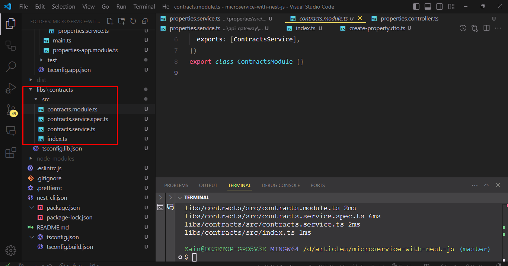

Create folder name `libs/contracts/src/properties` and copy all file from `apps/properties/src/properties` in it.

Now update path imports in these files

`apps/properties/src/properties/properties.controller.ts`

```ts
import { MessagePattern, Payload } from '@nestjs/microservices';
import { PropertiesService } from './properties.service';
import { CreatePropertyDto } from '@app/contracts/properties';
import { UpdatePropertyDto } from '@app/contracts/properties';
import { Controller } from '@nestjs/common';
```

`
apps\properties\src\properties\properties.service.ts`

```ts
import { Injectable } from '@nestjs/common';
import { CreatePropertyDto } from '@app/contracts/properties';
import { UpdatePropertyDto } from '@app/contracts/properties';
import { PropertyDto } from '@app/contracts/properties';
```

`apps/api-gateway/src/properties/properties.service.ts`

```ts
import {
  CreatePropertyDto as ClientCreatePropertyDto,
  UpdatePropertyDto as ClientUpdatePropertyDto,
  PropertyDto as ClientPropertyDto,
} from '@app/contracts/properties';
```

The problem described earlier is now resolved, as there is a clear separation between the microservices and the API gateway and we are not importing the dto directly from microservice in the api-gateway.

However, there’s another improvement worth addressing: we are currently hardcoding patterns and module Token. This hardcoding should be removed to enhance flexibility and maintainability

Create a file `properties.patterns` in `libs\contracts\src\properties.ts` and add this code

```ts
export const PROPERTY_PATTERN = {
  FIND_ALL: 'properties.findAll',
  FIND_ONE: 'properties.findOne',
  CREATE: 'properties.create',
  UPDATE: 'properties.update',
  REMOVE: 'properties.remove',
};
```

Create a file `apps/api-gateway/src/properties/constants/index.ts` and add this code
Create a file `apps/api-gateway/src/properties/constants/index.ts` and add this code

```ts
export const PROPERTIES_CLIENT = 'PROPERTIES_CLIENT';
```

Update the `libs/contracts/src/properties/index.ts`

```
export * from './create-property.dto';
export * from './property.dto';
export * from './update-property.dto';
export * from './properties.patterns';
```

Create a folder constants and create a file index.ts in it at path apps/api-gateway/src/properties/constants/index.ts

Now we can use the defined patterns and constants instead of hardcoding them

`apps/properties/src/properties/properties.controller.ts`

```ts
import { MessagePattern, Payload } from '@nestjs/microservices';
import { PropertiesService } from './properties.service';
import { CreatePropertyDto } from '@app/contracts/properties';
import { UpdatePropertyDto } from '@app/contracts/properties';
import { Controller } from '@nestjs/common';
import { PROPERTY_PATTERN } from '@app/contracts/properties/properties.patterns';

@Controller()
export class PropertiesController {
  constructor(private readonly propertiesService: PropertiesService) {}

  @MessagePattern(PROPERTY_PATTERN.CREATE)
  create(@Payload() createPropertyDto: CreatePropertyDto) {
    return this.propertiesService.create(createPropertyDto);
  }

  @MessagePattern(PROPERTY_PATTERN.FIND_ALL)
  findAll() {
    return this.propertiesService.findAll();
  }

  @MessagePattern(PROPERTY_PATTERN.FIND_ONE)
  findOne(@Payload() id: number) {
    return this.propertiesService.findOne(id);
  }

  @MessagePattern(PROPERTY_PATTERN.UPDATE)
  update(@Payload() updatePropertyDto: UpdatePropertyDto) {
    return this.propertiesService.update(
      updatePropertyDto.id,
      updatePropertyDto,
    );
  }

  @MessagePattern(PROPERTY_PATTERN.REMOVE)
  remove(@Payload() id: number) {
    return this.propertiesService.remove(id);
  }
}
```

`apps/api-gateway/src/properties/properties.module.ts`

```ts
import { Module } from '@nestjs/common';
import { PropertiesService } from './properties.service';
import { PropertiesController } from './properties.controller';
import { ClientsModule, Transport } from '@nestjs/microservices';
import { PROPERTIES_CLIENT } from './constants';

@Module({
  imports: [
    ClientsModule.registerAsync([
      {
        name: PROPERTIES_CLIENT,
        useFactory: async () => {
          return {
            transport: Transport.TCP,
            options: {
              port: 3001,
            },
          };
        },
      },
    ]),
  ],
  controllers: [PropertiesController],
  providers: [PropertiesService],
})
export class PropertiesModule {}
```

`apps/api-gateway/src/properties/properties.service.ts`

```ts
import { Injectable, Inject } from '@nestjs/common';
import { CreatePropertyDto } from './dto';
import { UpdatePropertyDto } from './dto';
import { ClientProxy } from '@nestjs/microservices';
import {
  CreatePropertyDto as ClientCreatePropertyDto,
  UpdatePropertyDto as ClientUpdatePropertyDto,
  PropertyDto as ClientPropertyDto,
} from '@app/contracts/properties';
import { PROPERTY_PATTERN } from '@app/contracts/properties/properties.patterns';
import { PROPERTIES_CLIENT } from './constants';

@Injectable()
export class PropertiesService {
  constructor(
    @Inject(PROPERTIES_CLIENT) private readonly propertiesClient: ClientProxy,
  ) {}

  create(createPropertyDto: CreatePropertyDto) {
    return this.propertiesClient.send<
      ClientPropertyDto,
      ClientCreatePropertyDto
    >(PROPERTY_PATTERN.CREATE, createPropertyDto);
  }

  findAll() {
    return this.propertiesClient.send<ClientPropertyDto[]>(
      PROPERTY_PATTERN.FIND_ALL,
      {},
    );
  }

  findOne(id: number) {
    return this.propertiesClient.send<ClientPropertyDto, number>(
      PROPERTY_PATTERN.FIND_ONE,
      id,
    );
  }

  update(id: number, updatePropertyDto: UpdatePropertyDto) {
    return this.propertiesClient.send<ClientUpdatePropertyDto>(
      PROPERTY_PATTERN.UPDATE,
      {
        id,
        ...updatePropertyDto,
      },
    );
  }

  remove(id: number) {
    return this.propertiesClient.send<ClientPropertyDto, number>(
      PROPERTY_PATTERN.REMOVE,
      id,
    );
  }
}
```

Now we can test the setup. Open Postman (or any tool of your choice) and send requests to each endpoint to verify they are working correctly

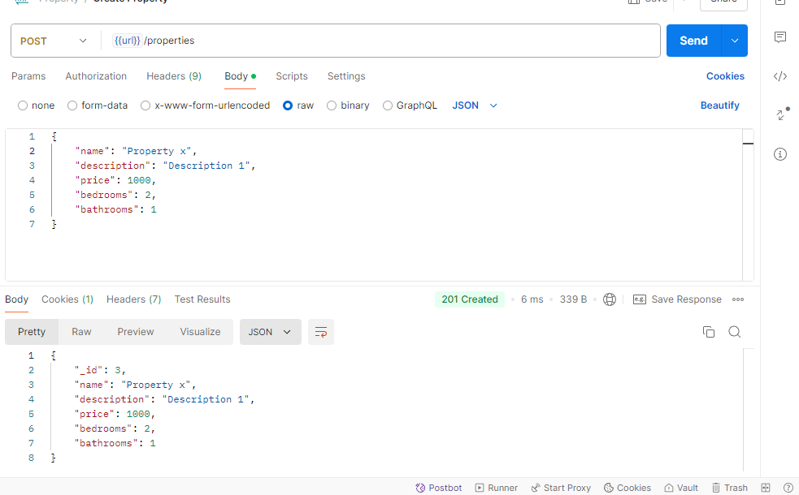
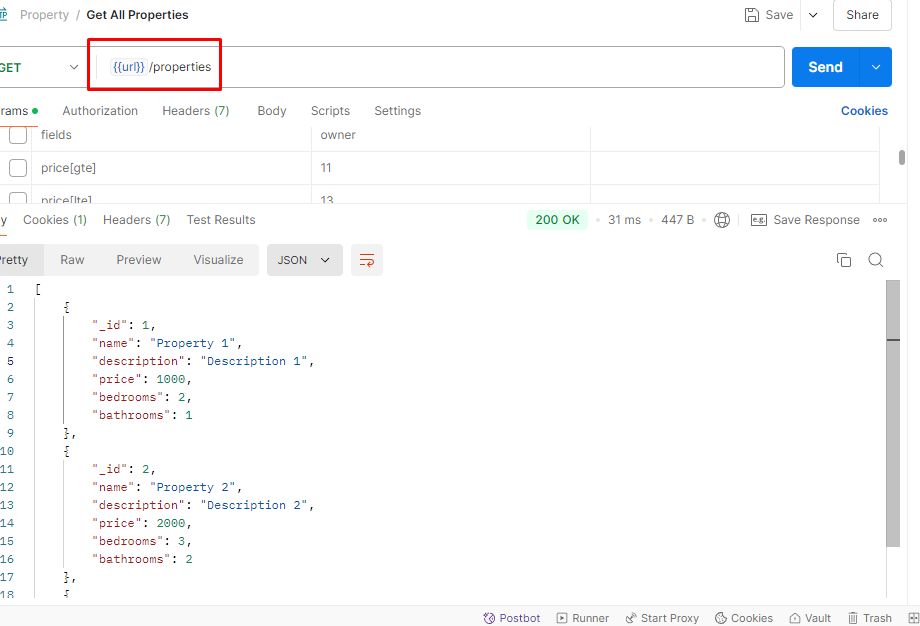
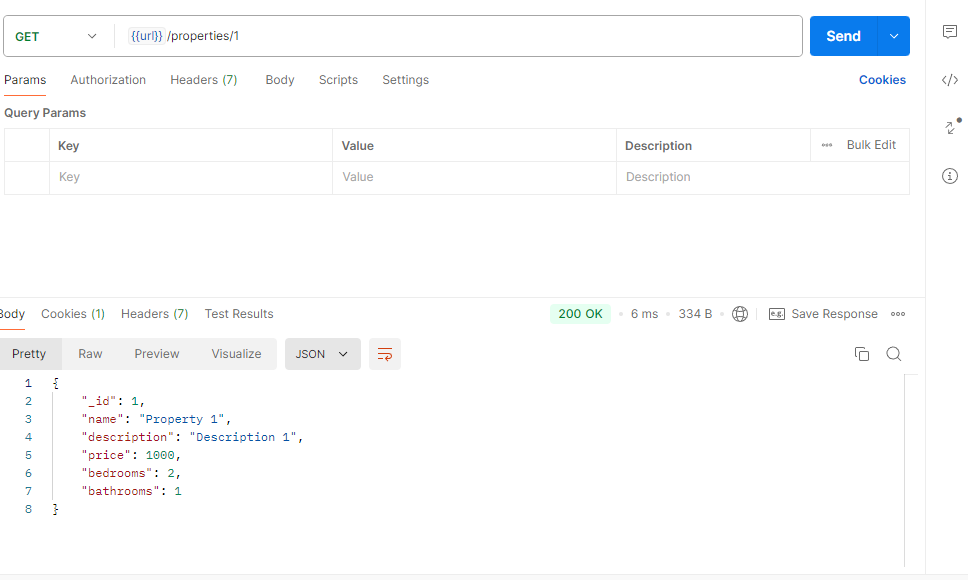
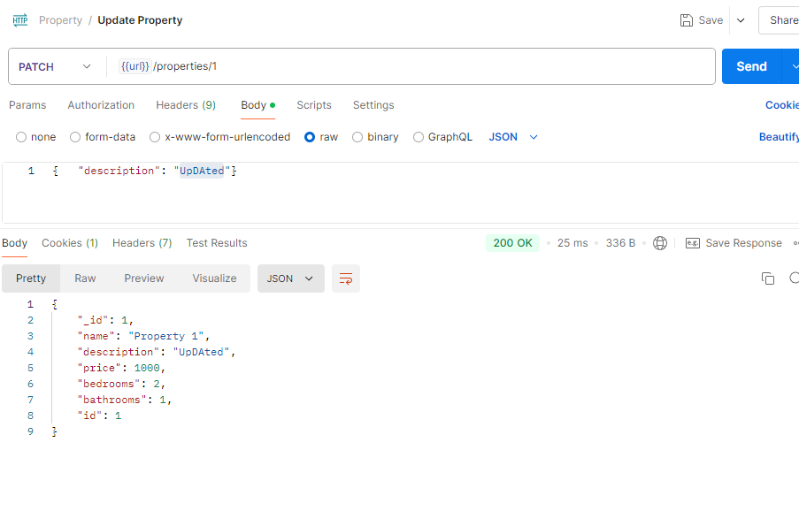
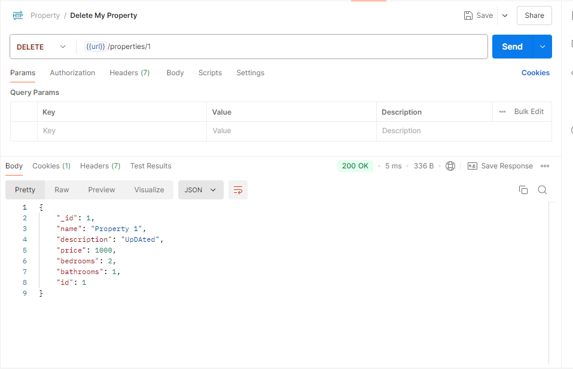

This is how data will flow in our system
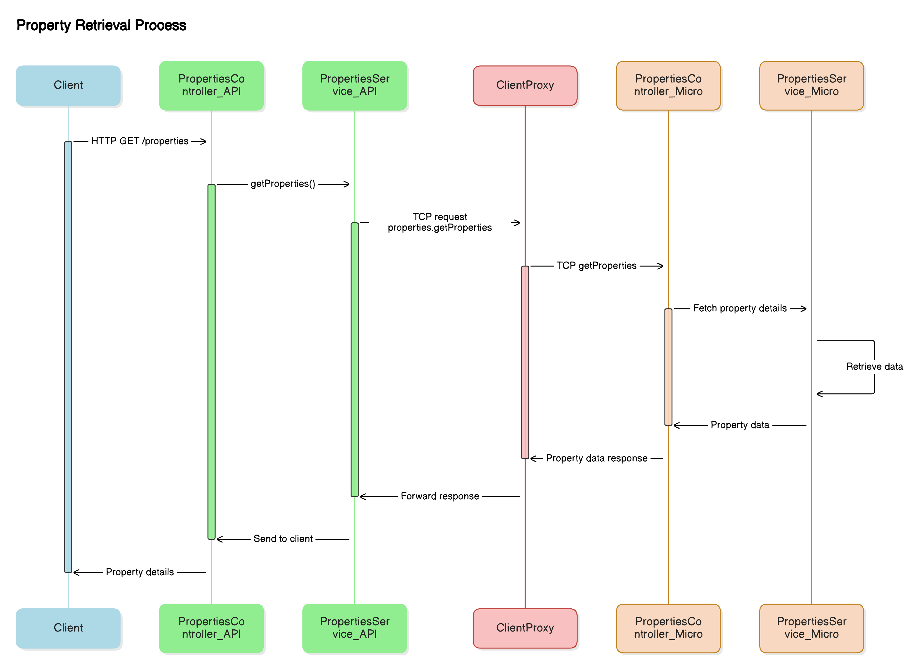

A typical microservices NestJS monorepo project is organized as follows:

```
/project
├── apps
│ ├── api-gateway
│ │ ├── src
│ │ │ ├── app
│ │ │ │ ├── properties (module)
│ │ │ │ └── ...other modules
│ │ │ ├── main.ts
│ │ │ └── ...
│ │ ├── test
│ │ └── ...
│ ├── properties (microservice)
│ │ ├── src
│ │ │ ├── properties (module)
│ │ │ ├── properties-app.module.ts
│ │ │ ├── main.ts (microservice app definition)
│ │ │ └── ...
│ │ ├── test
│ │ └── ...
│ └── ...other microservices
└── ...other config files
```
